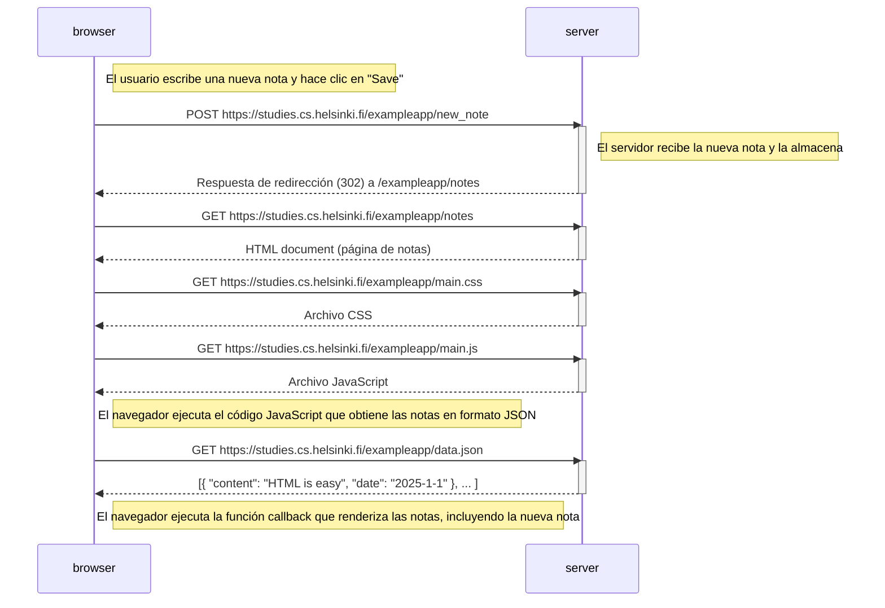

```mermaid
sequenceDiagram
    participant browser
    participant server

    Note right of browser: El usuario escribe una nueva nota y hace clic en "Save"

    browser->>server: POST https://studies.cs.helsinki.fi/exampleapp/new_note
    activate server
    Note right of server: El servidor recibe la nueva nota y la almacena
    server-->>browser: Respuesta de redirección (302) a /exampleapp/notes
    deactivate server

    browser->>server: GET https://studies.cs.helsinki.fi/exampleapp/notes
    activate server
    server-->>browser: HTML document (página de notas)
    deactivate server

    browser->>server: GET https://studies.cs.helsinki.fi/exampleapp/main.css
    activate server
    server-->>browser: Archivo CSS
    deactivate server

    browser->>server: GET https://studies.cs.helsinki.fi/exampleapp/main.js
    activate server
    server-->>browser: Archivo JavaScript
    deactivate server

    Note right of browser: El navegador ejecuta el código JavaScript que obtiene las notas en formato JSON

    browser->>server: GET https://studies.cs.helsinki.fi/exampleapp/data.json
    activate server
    server-->>browser: [{ "content": "HTML is easy", "date": "2025-1-1" }, ... ]
    deactivate server

    Note right of browser: El navegador ejecuta la función callback que renderiza las notas, incluyendo la nueva nota
```

